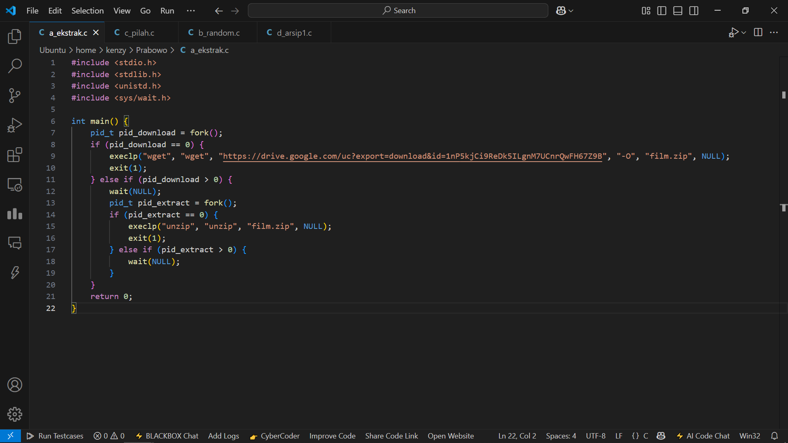
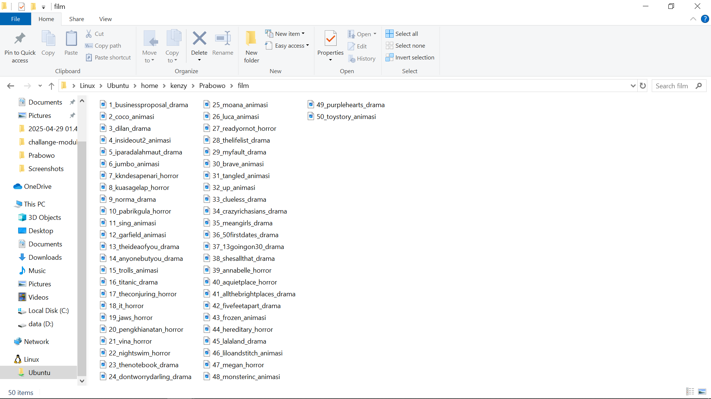
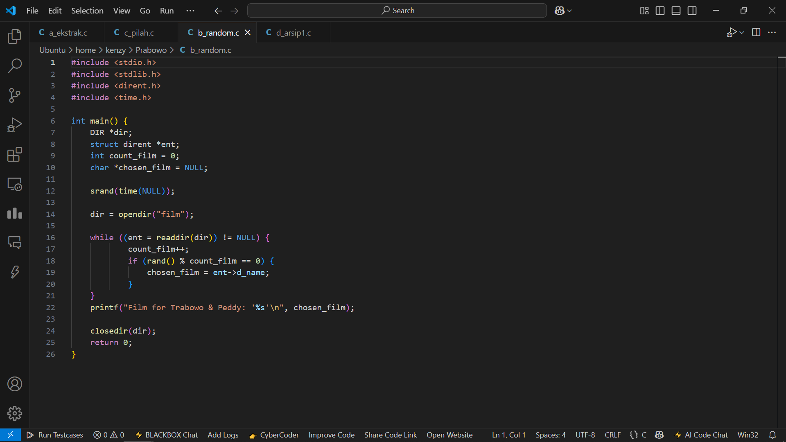
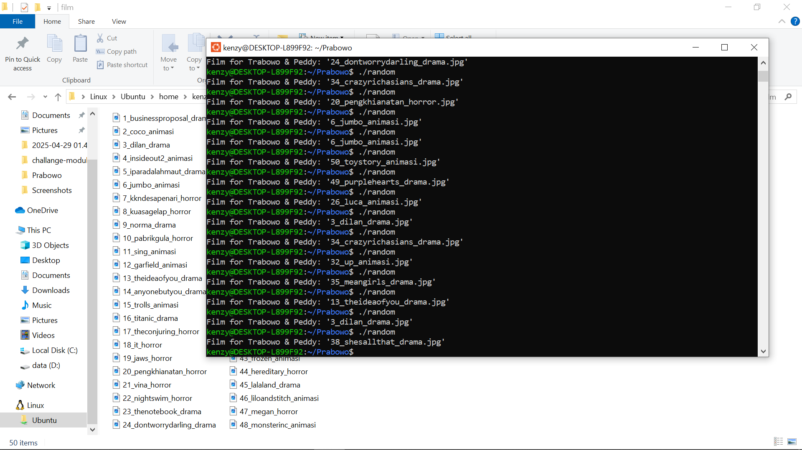
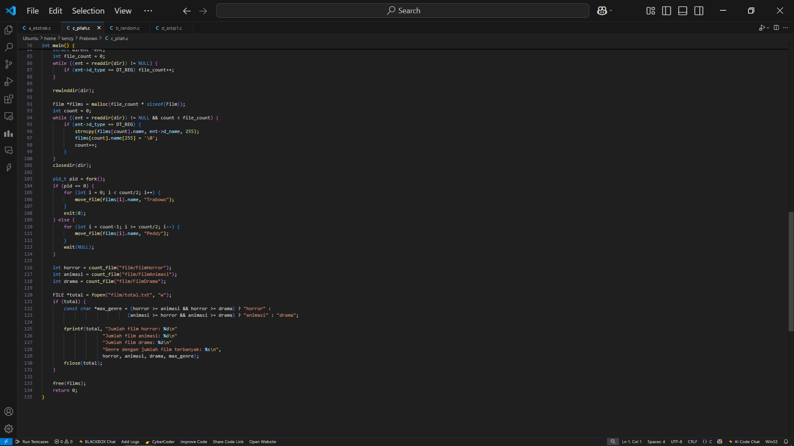
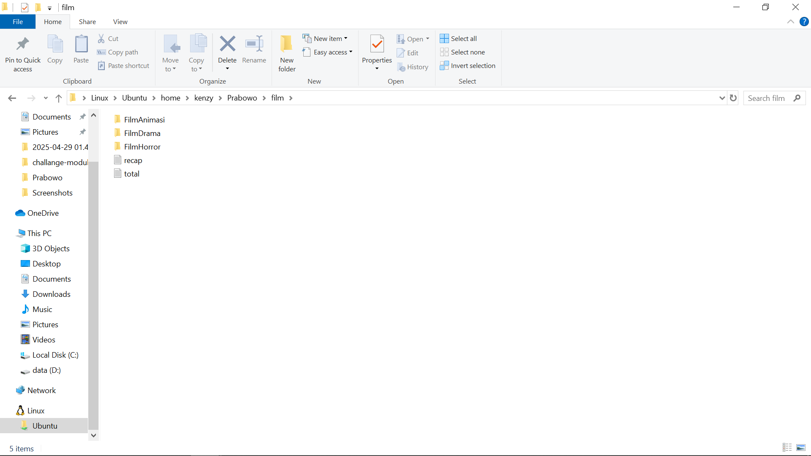
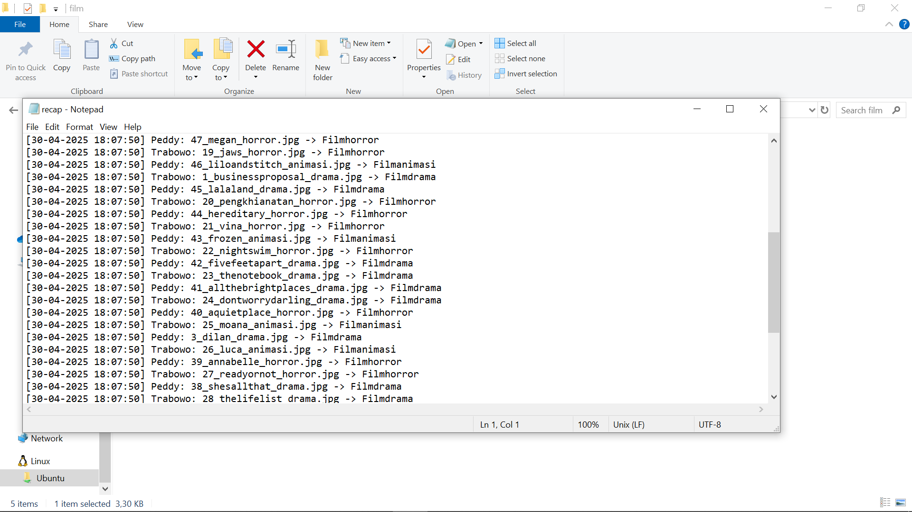
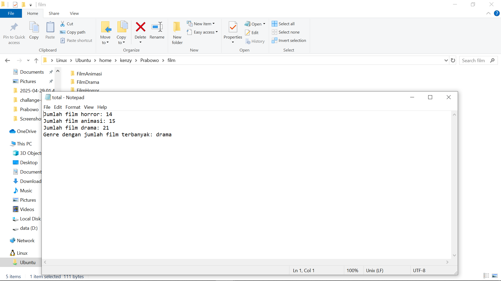
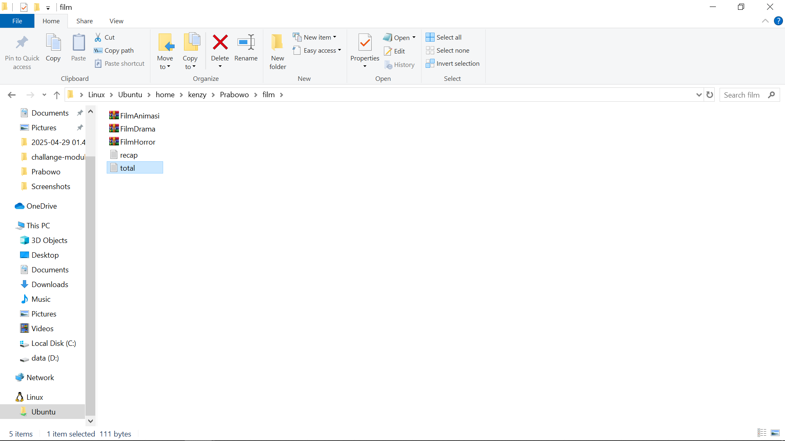

### Laporan task 1

### Subtask A

- Menggunakan wget untuk mendownload file zip dari gdrive pada proses child
- Menggunakan unzip pada parent untuk mengekstrak file zip yang sudah didownload

**Hasil output**

### Subtask B

- Menggunakan sracnd(time(NULL) untuk mendapatkan angka acak 
- Menggunakan while untuk menghitung jmlh film
- Menggunakan MOD untuk mencari film acak

**Hasil output**

### Subtask C

- Membuat fungsi untuk menghitung jumlah film
- Pada fungsi log menggunakan time(NULL) dan localtime(&now) untuk mendapatkan waktu saat ini
- Pada fungsi extract Menggunakan strchr untuk mendapatkan genre dari nama film
- Pada fungsi film menggunakan strcmp untuk membandingkan nama genre film agar dipindahkan ke folder sesuai genre film
- Pada main menggunakan mkdir untuk membuat folder 
- Menggunakan strncpy untuk menyalin nama film ke struck film
- Menggunakan fork dan if agar move film Peddy dan Trabowo dilakukan secara bergantian
- Membandingkan jmlh genre untuk mendapatkan genre yang paling banyak
- Menggunakan fprint untuk menampilakan jumlah genre serta genre yang paling banyak di folder total.txt

### Subtask D

- Pada fungsi zip menggunakan fork untuk membuat zip dan menghapus folder yang sudah dizip
- Membuat zip pada child dan menghapus folder pada parent
- Pada main chdir untuk menuju folder film

